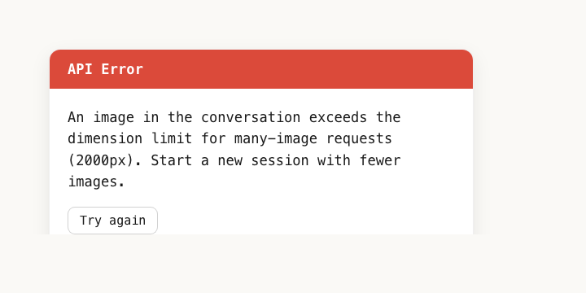

# shrink1999

> *Tonight we're gonna shrink images like it's 1999(px).*

**Auto-resize macOS screenshots to ≤1999px wide and copy them to your clipboard, so Claude (and other AI tools) stop rejecting them.**


---

## The problem

You take a screenshot. You drop it into Claude. You get this:



> *An image in the conversation exceeds the dimension limit for many-image requests (2000px). Start a new session with fewer images.*

Claude's API caps image dimensions at 2000px on the long side when there are multiple images in a conversation. **Every Retina screenshot exceeds this** — a stock MacBook Pro 14" screenshot is 3024×1964 minimum, and most people screenshot a portion of a wider external monitor and end up at 3000–4000px.

So the workflow becomes:

1. Take screenshot.
2. Try to drop it into Claude.
3. Wait for the API call to fail.
4. Open Preview / some online resizer / Photoshop.
5. Resize manually.
6. Re-drag the resized version.
7. Lose your train of thought.

This is a stupid problem to have to solve manually every time.

## What shrink1999 does

A `launchd` agent watches a folder (default `~/ClaudeImages`). When any image larger than 1999px on the long side appears there:

1. It's resized in place to ≤1999px (aspect ratio preserved).
2. The original is backed up to `~/.shrink1999-backups/YYYY-MM-DD/`.
3. **The shrunk image is copied to your clipboard.**
4. A banner notification shows `4032×3024 → 1999×1499 · ready to paste (Cmd+V)` and auto-dismisses.

You take a screenshot, hit `Cmd+V` in Claude. Done. You never see the error again.

The installer optionally redirects macOS screenshots (`Cmd+Shift+3/4/5`) to land in the watched folder, so the whole flow is invisible. If you skip that, just drop images into the folder yourself when you want them shrunk.

## Why this exists

I was on a roll inside Claude Code, dragged in a screenshot, and got the dimension error. Started a new session. Same thing. Realized I'd been manually resizing screenshots in Preview for weeks. Wrote this in 30 minutes and never thought about it again.

You shouldn't have to know what a pixel is to use an AI tool.

## Install

```bash
curl -fsSL https://raw.githubusercontent.com/nicolaskasaks-ui/shrink1999/main/install.sh | bash
```

The installer:
- Drops `shrink1999` into `~/.local/bin/`
- Creates `~/ClaudeImages/` (the watched folder)
- Loads a `launchd` agent that runs at login and stays alive
- Asks (interactive y/N) whether to point macOS screenshots at `~/ClaudeImages`

Or clone and run locally:

```bash
git clone https://github.com/nicolaskasaks-ui/shrink1999.git
cd shrink1999
./install.sh
```

## Usage

Just take a screenshot, or drop any image into `~/ClaudeImages`. That's it.

If you skipped the screenshot redirect during install, you can do it later:

```bash
defaults write com.apple.screencapture location ~/ClaudeImages && killall SystemUIServer
```

To revert:

```bash
defaults write com.apple.screencapture location ~/Desktop && killall SystemUIServer
```

## Configuration

| Env var         | Default              | What                                          |
| --------------- | -------------------- | --------------------------------------------- |
| `MAX`           | `1999`               | Max pixel dimension on the long side          |
| `NO_CLIPBOARD`  | unset                | Set to `1` to skip clipboard copy             |
| `NO_NOTIFY`     | unset                | Set to `1` to skip the banner notification    |

Want to watch a different folder? Edit `~/Library/LaunchAgents/com.shrink1999.autoshrink.plist` and change both occurrences of the path, then:

```bash
launchctl unload ~/Library/LaunchAgents/com.shrink1999.autoshrink.plist
launchctl load -w ~/Library/LaunchAgents/com.shrink1999.autoshrink.plist
```

## How it works (the whole thing)

About 80 lines of bash. Native macOS only:

- **`launchd` `WatchPaths`** — fires the worker whenever the folder changes. No polling, no fswatch, no daemon.
- **`sips`** — Apple's built-in image resizer (`sips --resampleHeightWidthMax`). Ships with every Mac.
- **`osascript`** — `display notification` for the banner, and `set the clipboard to (read POSIX file ... as «class PNGf»)` for the clipboard copy.
- **xattr marker** — files get `com.shrink1999.done` set after processing, so we never re-process the same file.
- **Atomic mkdir lock** — `mkdir /tmp/shrink1999.lock.d` to single-flight overlapping `launchd` fires (no `flock` on macOS).

Zero dependencies. No Homebrew. No Electron. No Python. No background daemon eating RAM. The agent is dormant unless something hits the folder.

## Uninstall

```bash
curl -fsSL https://raw.githubusercontent.com/nicolaskasaks-ui/shrink1999/main/uninstall.sh | bash
```

Removes the agent and binary. Asks before reverting your screenshot location. Leaves your images and backups alone.

## Troubleshooting

### I don't see the notification banner

The notification still fired and the clipboard still has the shrunk image — you can paste with `Cmd+V`. But to make banners visible:

1. **System Settings → Notifications →** scroll down and find **Script Editor**.
   Enable *Allow Notifications* and choose *Banners* (not *Alerts* — alerts require a click to dismiss).
2. **Disable Focus modes.** If Do Not Disturb, Work, or any other Focus is active, banners are silenced. Click the date/time in the top-right of the menu bar and check your Focus state.

Why "Script Editor"? `osascript display notification` uses the system Script Editor's notification entitlement. There's no way to register a custom name without shipping a signed `.app` bundle, which would defeat the "zero dependencies, one curl" install.

### How do I know it's working at all?

Check the log:

```bash
tail -f ~/Library/Logs/shrink1999.log
```

Drop an image into `~/ClaudeImages` and you should see a `shrunk:` line within a second.

### It says "shrunk" but Cmd+V doesn't paste an image

Some apps don't accept clipboard images via the standard PNG pasteboard type. Test with Preview: open Preview, then File → New from Clipboard. If that works, the clipboard is fine and the issue is the destination app.

## FAQ

**Does it work for non-screenshot images?**
Yes. Anything you drop in the watched folder gets processed if it's >1999px. Skips files already small enough.

**Will it shrink images I don't want shrunk?**
Only files in the watched folder. Originals are always backed up, so worst case you copy the original back from `~/.shrink1999-backups/`.

**Why 1999 and not 2000?**
Claude's limit is "exceeds 2000px," meaning 2000 itself can occasionally trip the check depending on how dimensions round. 1999 is safely under. Also: Prince.

**Does this work on Linux/Windows?**
No. macOS only. The whole thing is built on `sips` + `launchd` + `osascript`. Linux equivalent would be `inotifywait` + `convert` + `xclip` and is left as an exercise to whoever opens the PR.

**Why not just use ImageMagick?**
Because then you'd need to install ImageMagick. `sips` ships with macOS.

**Does this send my images anywhere?**
No. Everything runs locally. The script makes zero network calls. Read the source — it's 80 lines.

## Roadmap

- [ ] Linux port (PRs welcome)
- [ ] Configurable folder via install flag
- [ ] Raycast extension
- [ ] Optional Sharpie pass after downscale (sharpening is lost on resize)

## Credits

Named after [Prince's "1999"](https://www.youtube.com/watch?v=rblt2EtFfC4). Built by [@nicolaskasaks-ui](https://github.com/nicolaskasaks-ui).

## License

MIT
